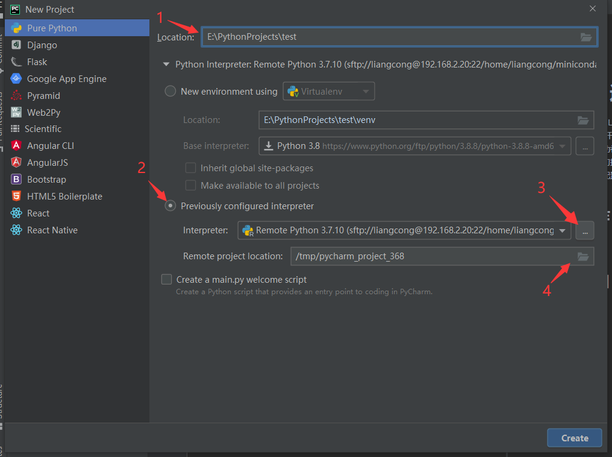
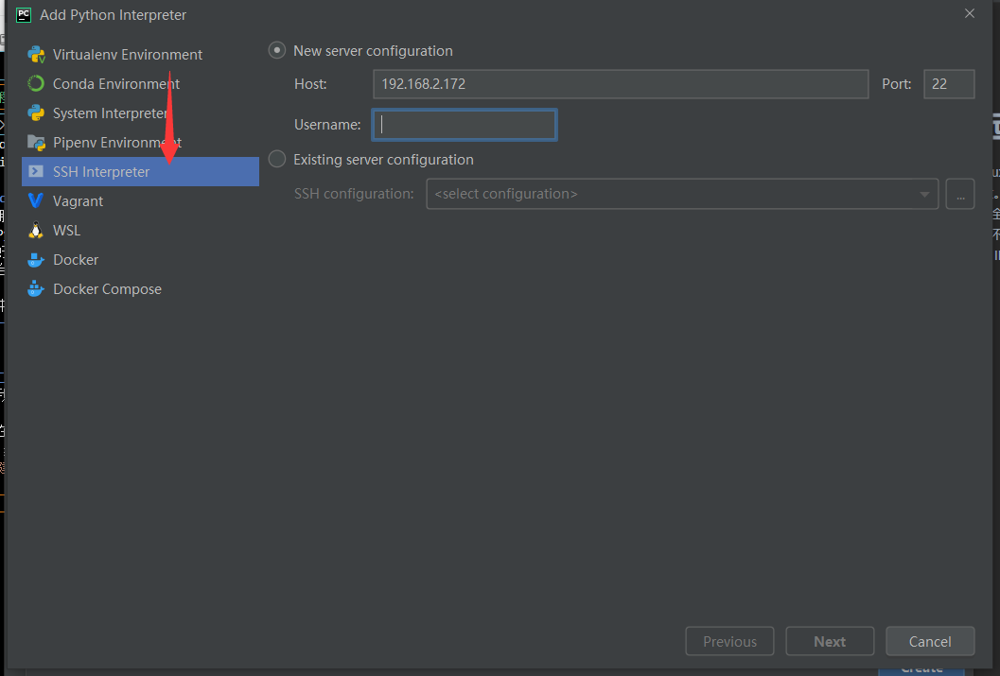
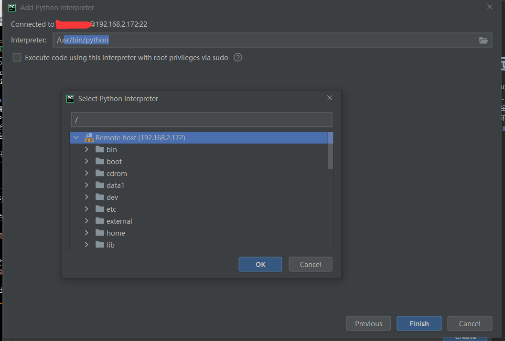
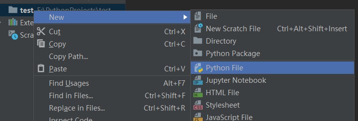
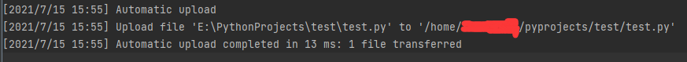
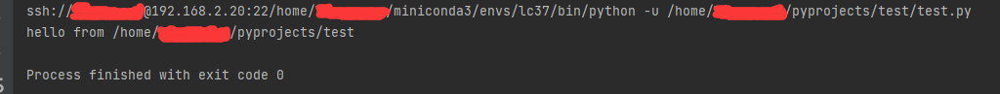

Author: Scorpior  
Version: 1.0

# Pycharm 远程开发配置
GPU 服务器通常采用 Linux 系统，并且不会配置图形桌面，无法方便地利用 IDE 进行代码开发。Pycharm 专业版的远程开发功能可以很好地满足我们对代码自动补全等需求，还有一个额外的好处是可以通过配置远程解释器方便地切换不同服务器。如果不使用远程开发，我们可能得在每台服务器上都配置 IDE 才能方便地使用它们。

下文中我们把远程 Linux 主机称为**服务器**，我们直接操作的电脑称为**本地**。
## 一. 前置工作
首先

## 二. 新建项目
首先我们在本地 Pycharm 中新建项目 Pure Python，并在右侧第一行配置好本地路径（箭头1）。  
然后在右侧下方配置 python 解释器，选择 Previously configured interpreter （箭头2），然后选择右边3个点配置远程服务器（箭头3）。


进入 interpreter 配置页面如下图，左边栏选择 SSH Interpreter，填好右边服务器与用户名后点击右下 Next


在弹出的认证界面点 Yes，然后在下一个页面填好登录密码，就来到真正选择解释器的界面。我们在这里选择要用的 python 解释器的路径，如果装了 miniconda 并新建了环境（比如名为 abc 的环境），那么路径应该为 `~/miniconda3/envs/abc/bin/python`。这里 `bin` 之前的路径按实际情况更改，最终要选 `python` 而不是 `python3`。


选好后点 Finish，就回到第一张图，继续**使用绝对路径**配置 Remote project location （箭头4）后即可点击右下角 Create。此处无法识别相对路径 `~`。

## 三. 同步文件
### 3.1. 从本地同步到服务器
如图在本地文件夹新建 **test.py**

完成后就会发现下方 File Transfer 对话框自动出现了三行字告诉你，pycharm 已经自动把这个文件上传了

这是因为在菜单栏 **Tools-Deployment** 里的 **Automatic Upload** 选项是默认打开的。如果此选项已关闭或者其他原因需要手动上传，可以通过 Tools-Deployment 里的其他按钮进行。

## 四. 试运行
在我们本地的 test.py 文件里输入如下代码
```python
import os

if __name__ == "__main__":
    print("hello from", os.path.abspath('.'))
```
保存并同步到服务器后，`ctrl+shift+F10` 运行这个文件，在控制台看见输出

其中打印的路径是服务器上 test.py 的所在位置，这证明我们的代码是在服务器上运行的。
