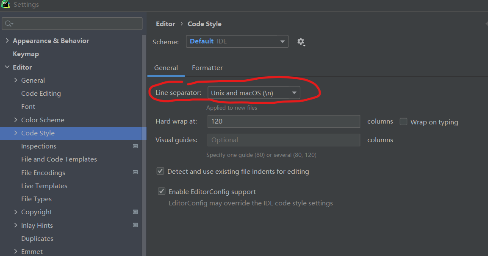

# WSL+ROS 配置琐碎

### 1. 基础安装
我的 WSL2 默认是 Ubuntu18.04，对应的 ROS 版本是 **melodic**，按照 [官方安装步骤](http://wiki.ros.org/melodic/Installation/Ubuntu) 走完即可。

### 2. 在 ros 中使用 python3
只需要配置好 python3 中的 ROS 相关库，并在运行 catkin_make 时提供一下相关参数。catkin_make 完成后，正常 rosrun 这个包就会自动使用 python3。
1. 在完成 ROS 基础安装后运行
```bash
# 安装 python3 所需 ros 库
pip3 install catkin_pkg pyyaml empy rospkg numpy
```
2. 使用带参数的 catkin_make
```bash
# 这里指定 python3 的路径，要与实际 python3 位置一致
catkin_make -DPYTHON_EXECUTABLE=/usr/bin/python3
```
可以在 ~/.bashrc 里添加 `alias catkin_make3='catkin_make -DPYTHON_EXECUTABLE=/usr/bin/python3'`，方便调用。
3. 运行编译好的节点
```bash
# pkg_name 和 script_name 换成实际包名和文件名
rosrun pkg_name script_name.py
```

### 3. python 文件权限报错
```err
Couldn't find executable named ...
Found the following, but they're either not files,
or not executable:
  ...
```
解决方法：`sudo chmod +x 路径/script_name.py`

### 4. python 换行符导致的报错
```err
... /usr/bin/python3^M: bad interpreter: No such file or directory
```
#### 4.1 用 pycharm 修改
1. pycharm **设置-Editor-Code Style** 页面，更改 **Line separator** 为 **Unix and maxOS**。

2. pycharm 编辑窗口下方将 `CRLF` 改为 `LF`


#### 4.2 用 vim 修改
1. 在 ubuntu 内用 vim 打开 .py 文件
2. 输入 
```vi
:set ff=unix
```
3. 保存退出（`:wq`)